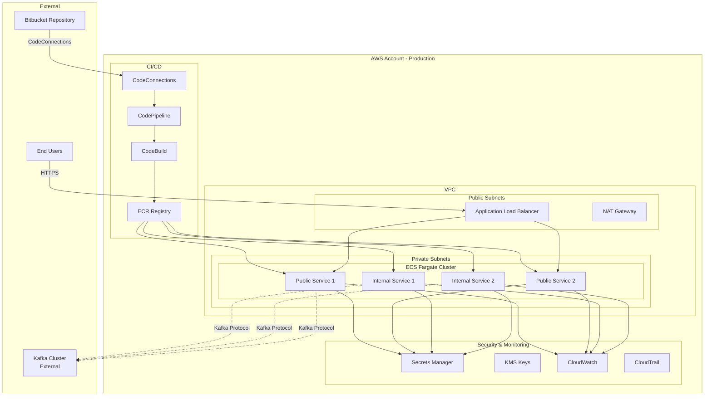

# Design Document

## Overview

This design document outlines a production-ready AWS ECS Fargate infrastructure with automated CI/CD pipelines for 12 microservices (10 Node.js, 2 Python). The system implements a multi-environment deployment workflow (develop, test, QA, production) with security controls meeting NIST and SOC-2 compliance requirements. The infrastructure is defined using Terraform modules to enable easy service replication and consistent deployments.

The architecture supports two service types:
- **Public-facing services**: Exposed via Application Load Balancer for HTTP/HTTPS traffic
- **Internal services**: Communicate via Kafka message broker (managed externally)

## Architecture

### High-Level Architecture



### Environment Architecture

Each environment (develop, test, QA, production) follows the same architectural pattern with environment-specific configurations:

- **Develop**: Lower resource limits, relaxed security for development
- **Test/QA**: Production-like configuration for validation
- **Production**: Full security controls, higher resource limits, stricter access controls

### Terraform Module Structure

```
terraform/
├── modules/
│   ├── networking/          # VPC, subnets, security groups
│   ├── ecs-cluster/         # ECS cluster configuration
│   ├── ecs-service/         # Reusable service module
│   ├── ecr/                 # Container registry
│   ├── cicd/                # CodePipeline and CodeBuild
│   ├── alb/                 # Application Load Balancer
│   ├── monitoring/          # CloudWatch, alarms
│   └── security/            # KMS, Secrets Manager, IAM
├── environments/
│   ├── develop/
│   ├── test/
│   ├── qa/
│   └── prod/
└── services/
    ├── service-1/
    ├── service-2/
    └── ...
```

## Components and Interfaces

### 1. Terraform Service Module

**Purpose**: Reusable module for deploying individual microservices

**Inputs**:
- `service_name`: Unique identifier for the service
- `runtime`: "nodejs" or "python"
- `repository_url`: Bitbucket repository URL
- `service_type`: "public" or "internal"
- `container_port`: Port the container listens on
- `cpu`: Fargate CPU units (256, 512, 1024, 2048, 4096)
- `memory`: Fargate memory in MB
- `environment`: "develop", "test", "qa", "prod"
- `desired_count`: Number of tasks to run
- `autoscaling_min`: Minimum tasks for autoscaling
- `autoscaling_max`: Maximum tasks for autoscaling
- `health_check_path`: Path for health checks (public services only)
- `secrets_arns`: List of Secrets Manager ARNs to inject

**Outputs**:
- `service_arn`: ECS service ARN
- `service_name`: ECS service name
- `ecr_repository_url`: ECR repository URL
- `pipeline_name`: CodePipeline name
- `task_role_arn`: IAM role ARN for tasks
- `security_group_id`: Security group ID

**Resources Created**:
- ECR repository with lifecycle policies
- ECS task definition
- ECS service
- IAM roles (task role, execution role)
- Security groups
- CloudWatch log group
- CodePipeline with stages
- CodeBuild project
- Target group and ALB listener rule (if service_type = "public")
- Auto-scaling policies
- CloudWatch alarms

### 2. Networking Module

**Purpose**: Create VPC infrastructure with public and private subnets

**Resources**:
- VPC with DNS support enabled
- 3 public subnets across availability zones
- 3 private subnets across availability zones
- Internet Gateway for public subnets
- NAT Gateways in each public subnet (high availability)
- Route tables for public and private subnets
- VPC Flow Logs to CloudWatch
- Network ACLs for additional security layer

**Security Groups**:
- ALB security group: Allows inbound 80/443 from internet
- Public service security group: Allows inbound from ALB security group
- Internal service security group: Allows inbound from other services and Kafka
- Kafka client security group: Allows outbound to Kafka brokers

### 3. ECS Cluster Module

**Purpose**: Create and configure ECS Fargate cluster

**Resources**:
- ECS cluster with container insights enabled
- Cluster capacity providers (FARGATE, FARGATE_SPOT)
- Default capacity provider strategy
- CloudWatch log group for cluster logs

**Configuration**:
- Enable CloudWatch Container Insights for monitoring
- Configure execute command logging for debugging
- Set default capacity provider strategy (70% FARGATE, 30% FARGATE_SPOT for cost optimization in non-prod)

### 4. CI/CD Module

**Purpose**: Create CodePipeline for automated deployments

**Pipeline Stages**:

1. **Source Stage**:
   - Trigger: CodeConnections webhook from Bitbucket
   - Branch filters based on environment:
     - Develop: feature/* branches (manual trigger)
     - Test/QA: release/*.*.* branches (automatic)
     - Prod: prod/* branches (manual approval required)
   - Output: Source code artifact

2. **Build Stage**:
   - CodeBuild project with environment-specific buildspec
   - Build Docker image
   - Run security scanning (trivy, snyk)
   - Run unit tests
   - Push image to ECR with tags: commit SHA, branch name, environment
   - Output: Image definitions artifact

3. **Approval Stage** (Production only):
   - Manual approval via SNS notification
   - Approval timeout: 7 days
   - Requires approval from designated approvers

4. **Deploy Stage**:
   - ECS deployment action
   - Rolling update strategy
   - Deployment configuration:
     - Minimum healthy percent: 100
     - Maximum percent: 200
   - Deployment timeout: 15 minutes

**CodeBuild Configuration**:
- Build environment: Ubuntu standard 7.0
- Privileged mode: enabled (for Docker builds)
- Environment variables:
  - AWS_ACCOUNT_ID
  - ECR_REPOSITORY_URL
  - IMAGE_TAG
  - ENVIRONMENT
- Buildspec location: buildspec.yml in repository
- Cache: Docker layer caching to S3

### 5. ECR Module

**Purpose**: Manage container image registry

**Configuration**:
- Repository per service
- Image tag immutability: enabled
- Scan on push: enabled
- Encryption: AES256 with KMS customer-managed key
- Lifecycle policy:
  - Keep last 10 tagged images
  - Remove untagged images after 7 days
  - Keep images tagged with "prod-*" indefinitely
- Repository policy: Allow pull from ECS task execution role

### 6. Application Load Balancer Module

**Purpose**: Route HTTP/HTTPS traffic to public-facing services

**Configuration**:
- Internet-facing ALB in public subnets
- HTTPS listener with ACM certificate
- HTTP listener redirects to HTTPS
- Access logs to S3 bucket (encrypted, versioned)
- Deletion protection enabled in production
- Drop invalid header fields enabled
- Idle timeout: 60 seconds

**Target Groups** (per public service):
- Protocol: HTTP
- Health check:
  - Path: configurable per service
  - Interval: 30 seconds
  - Timeout: 5 seconds
  - Healthy threshold: 2
  - Unhealthy threshold: 3
- Deregistration delay: 30 seconds
- Stickiness: disabled (stateless services)

**Listener Rules**:
- Path-based routing to appropriate target groups
- Host-based routing (optional)
- Priority-based rule ordering

### 7. Security Module

**Purpose**: Manage encryption keys, secrets, and IAM policies

**KMS Keys**:
- ECS encryption key: Encrypt ECS task volumes
- ECR encryption key: Encrypt container images
- Secrets encryption key: Encrypt secrets at rest
- CloudWatch encryption key: Encrypt logs
- S3 encryption key: Encrypt ALB logs, pipeline artifacts

**Secrets Manager**:
- Secrets per service for sensitive configuration
- Automatic rotation enabled where supported
- Resource-based policies for least privilege access
- Secrets tagged with service name and environment

**IAM Roles**:

1. **ECS Task Execution Role**:
   - Pull images from ECR
   - Write logs to CloudWatch
   - Read secrets from Secrets Manager
   - Decrypt using KMS keys

2. **ECS Task Role**:
   - Service-specific permissions
   - Access to required AWS services (S3, DynamoDB, etc.)
   - Read-only access to service-specific secrets

3. **CodeBuild Service Role**:
   - Pull source from CodeConnections
   - Push images to ECR
   - Write logs to CloudWatch
   - Read build secrets

4. **CodePipeline Service Role**:
   - Access to S3 artifact bucket
   - Trigger CodeBuild
   - Deploy to ECS
   - Send SNS notifications

### 8. Monitoring Module

**Purpose**: Centralized logging, metrics, and alerting

**CloudWatch Log Groups**:
- Per-service log groups with retention policies:
  - Production: 90 days
  - Non-production: 30 days
- Log encryption with KMS
- Log insights queries for common patterns

**CloudWatch Alarms**:

Per Service:
- High CPU utilization (> 80% for 5 minutes)
- High memory utilization (> 80% for 5 minutes)
- Task failure rate (> 2 failures in 5 minutes)
- Target response time (> 2 seconds for 5 minutes)
- Unhealthy target count (> 0 for 5 minutes)

Cluster-wide:
- Total task count below minimum
- Failed deployments
- Pipeline failures

**SNS Topics**:
- Critical alarms topic (PagerDuty integration)
- Warning alarms topic (email notifications)
- Pipeline notifications topic (Slack integration)

**CloudWatch Dashboards**:
- Cluster overview: Task counts, CPU, memory
- Service-specific: Request rates, latencies, errors
- Pipeline status: Build success rate, deployment frequency

### 9. Service Discovery

**Purpose**: Enable internal service-to-service communication

**AWS Cloud Map**:
- Private DNS namespace per environment
- Service discovery for internal services
- Health checks integrated with ECS
- DNS records automatically updated

**Configuration**:
- Namespace: `{environment}.internal`
- Service DNS: `{service-name}.{environment}.internal`
- TTL: 10 seconds for fast failover
- Health check: ECS task health status

## Data Models

### Terraform Variables Structure

```hcl
# Service Configuration
variable "services" {
  type = map(object({
    name               = string
    runtime            = string  # "nodejs" or "python"
    repository_url     = string
    branch_pattern     = string
    service_type       = string  # "public" or "internal"
    container_port     = number
    cpu                = number
    memory             = number
    desired_count      = number
    autoscaling_min    = number
    autoscaling_max    = number
    health_check_path  = string  # For public services
    environment_vars   = map(string)
    secrets_arns       = list(string)
  }))
}

# Environment Configuration
variable "environment" {
  type = string
  validation {
    condition     = contains(["develop", "test", "qa", "prod"], var.environment)
    error_message = "Environment must be develop, test, qa, or prod"
  }
}

# Network Configuration
variable "vpc_cidr" {
  type = string
}

variable "availability_zones" {
  type = list(string)
}

# Kafka Configuration
variable "kafka_brokers" {
  type = list(string)
  description = "List of Kafka broker endpoints"
}

variable "kafka_security_group_id" {
  type = string
  description = "Security group ID for Kafka cluster"
}

# Security Configuration
variable "allowed_cidr_blocks" {
  type = list(string)
  description = "CIDR blocks allowed to access ALB"
}

variable "enable_deletion_protection" {
  type = bool
  default = true
}

# Compliance Tags
variable "mandatory_tags" {
  type = object({
    Environment = string
    Owner       = string
    CostCenter  = string
    Compliance  = string
  })
}
```

### ECS Task Definition Structure

```json
{
  "family": "{service-name}-{environment}",
  "networkMode": "awsvpc",
  "requiresCompatibilities": ["FARGATE"],
  "cpu": "256",
  "memory": "512",
  "executionRoleArn": "{execution-role-arn}",
  "taskRoleArn": "{task-role-arn}",
  "containerDefinitions": [
    {
      "name": "{service-name}",
      "image": "{ecr-repository-url}:latest",
      "portMappings": [
        {
          "containerPort": 3000,
          "protocol": "tcp"
        }
      ],
      "environment": [
        {
          "name": "NODE_ENV",
          "value": "production"
        },
        {
          "name": "KAFKA_BROKERS",
          "value": "broker1:9092,broker2:9092"
        }
      ],
      "secrets": [
        {
          "name": "DATABASE_PASSWORD",
          "valueFrom": "{secret-arn}:password::"
        }
      ],
      "logConfiguration": {
        "logDriver": "awslogs",
        "options": {
          "awslogs-group": "/ecs/{service-name}",
          "awslogs-region": "us-east-1",
          "awslogs-stream-prefix": "ecs"
        }
      },
      "healthCheck": {
        "command": ["CMD-SHELL", "curl -f http://localhost:3000/health || exit 1"],
        "interval": 30,
        "timeout": 5,
        "retries": 3,
        "startPeriod": 60
      }
    }
  ]
}
```

### Buildspec Structure

```yaml
version: 0.2

phases:
  pre_build:
    commands:
      - echo Logging in to Amazon ECR...
      - aws ecr get-login-password --region $AWS_DEFAULT_REGION | docker login --username AWS --password-stdin $AWS_ACCOUNT_ID.dkr.ecr.$AWS_DEFAULT_REGION.amazonaws.com
      - COMMIT_HASH=$(echo $CODEBUILD_RESOLVED_SOURCE_VERSION | cut -c 1-7)
      - IMAGE_TAG=${COMMIT_HASH:=latest}
  
  build:
    commands:
      - echo Build started on `date`
      - echo Building the Docker image...
      - docker build -t $ECR_REPOSITORY_URL:latest .
      - docker tag $ECR_REPOSITORY_URL:latest $ECR_REPOSITORY_URL:$IMAGE_TAG
      - docker tag $ECR_REPOSITORY_URL:latest $ECR_REPOSITORY_URL:$ENVIRONMENT-$IMAGE_TAG
      
      - echo Running security scan...
      - trivy image --severity HIGH,CRITICAL $ECR_REPOSITORY_URL:latest
      
      - echo Running tests...
      - docker run $ECR_REPOSITORY_URL:latest npm test
  
  post_build:
    commands:
      - echo Build completed on `date`
      - echo Pushing the Docker images...
      - docker push $ECR_REPOSITORY_URL:latest
      - docker push $ECR_REPOSITORY_URL:$IMAGE_TAG
      - docker push $ECR_REPOSITORY_URL:$ENVIRONMENT-$IMAGE_TAG
      
      - echo Writing image definitions file...
      - printf '[{"name":"%s","imageUri":"%s"}]' $CONTAINER_NAME $ECR_REPOSITORY_URL:$IMAGE_TAG > imagedefinitions.json

artifacts:
  files:
    - imagedefinitions.json
```

## Correctness Properties

*A property is a characteristic or behavior that should hold true across all valid executions of a system-essentially, a formal statement about what the system should do. Properties serve as the bridge between human-readable specifications and machine-verifiable correctness guarantees.*


### Property Reflection

After analyzing all acceptance criteria, several properties are redundant or can be combined:

**Redundant Properties**:
- 1.5 and 1.6 are both covered by 1.4 (service type conditional resource creation)
- 2.1 and 4.4 both test KMS encryption (can be combined into one comprehensive property)
- 2.3 and 4.5 both test ECR scanning (duplicate)
- 2.4, 7.2, and 7.3 all test VPC subnet architecture (can be combined)
- 8.3 is inherent ALB behavior covered by 8.2 (health check configuration)

**Combined Properties**:
- Encryption properties (2.1, 4.4, 9.5) can be combined into one property testing KMS encryption across all resources
- Security group properties (7.5, 7.6, 7.7, 7.8) can be combined into comprehensive security group validation
- Network architecture properties (2.4, 7.2, 7.3, 7.4) can be combined into VPC architecture validation

This reflection reduces ~70 testable criteria to ~40 unique, non-redundant properties.

### Correctness Properties

Property 1: Module resource creation completeness
*For any* valid service configuration, invoking the Terraform module should create all required core resources (ECR repository, ECS task definition, ECS service, IAM roles, CloudWatch log group, CodePipeline, CodeBuild project)
**Validates: Requirements 1.2**

Property 2: Runtime configuration support
*For any* service configuration with runtime set to "nodejs" or "python", the resulting task definition should use the appropriate base image and runtime-specific configurations
**Validates: Requirements 1.3**

Property 3: Conditional ALB resource creation
*For any* service configuration, when service_type is "public", ALB resources (target group, listener rules) should be created, and when service_type is "internal", these resources should not be created
**Validates: Requirements 1.4, 1.5, 1.6**

Property 4: Module outputs presence
*For any* successful module invocation, all required outputs (service_arn, ecr_repository_url, pipeline_name, task_role_arn, security_group_id) should be defined and non-empty
**Validates: Requirements 1.8**

Property 5: KMS encryption at rest
*For any* resource that stores data at rest (ECS volumes, ECR repositories, Secrets Manager secrets, CloudWatch logs, S3 buckets), the resource configuration should reference a customer-managed KMS key ARN
**Validates: Requirements 2.1, 4.4, 9.5**

Property 6: TLS encryption in transit
*For any* ALB HTTPS listener configuration, the SSL policy should enforce TLS 1.2 or higher
**Validates: Requirements 2.2**

Property 7: ECR vulnerability scanning
*For any* ECR repository created by the module, scan_on_push should be enabled
**Validates: Requirements 2.3, 4.5**

Property 8: VPC network segmentation
*For any* VPC configuration, private subnets should have route tables pointing to NAT gateways (not internet gateways), public subnets should have route tables pointing to internet gateways, and ECS services should be placed in private subnets while ALBs should be placed in public subnets
**Validates: Requirements 2.4, 7.2, 7.3, 7.4**

Property 9: CloudWatch log retention
*For any* CloudWatch log group in production environment, retention_in_days should be set to 90 or greater
**Validates: Requirements 2.6**

Property 10: Security group least privilege
*For any* security group configuration, there should be no ingress rules allowing 0.0.0.0/0 access except for ALB security groups on ports 80 and 443
**Validates: Requirements 2.7**

Property 11: Container insights enabled
*For any* ECS cluster configuration, container_insights setting should be "enabled"
**Validates: Requirements 2.8**

Property 12: CodeConnections authentication
*For any* CodePipeline source stage, the configuration should use CodeConnections action provider with Bitbucket connection ARN
**Validates: Requirements 3.4**

Property 13: CodeBuild integration
*For any* CodePipeline build stage, the configuration should use CodeBuild action provider with a valid project name
**Validates: Requirements 3.5**

Property 14: Multi-tag image pushing
*For any* buildspec configuration, the post_build phase should include commands to tag and push images with at least commit SHA, environment, and latest tags
**Validates: Requirements 3.6**

Property 15: Pipeline per service
*For any* set of service configurations, each service should have a unique CodePipeline resource with a distinct name
**Validates: Requirements 3.7**

Property 16: Zero-downtime deployment configuration
*For any* ECS service deployment configuration, minimum_healthy_percent should be 100 or greater to ensure previous version remains running during failed deployments
**Validates: Requirements 3.8**

Property 17: ECR repository per service
*For any* service configuration, exactly one ECR repository should be created with a name matching the service name
**Validates: Requirements 4.1**

Property 18: ECR tag immutability
*For any* ECR repository configuration, image_tag_mutability should be set to "IMMUTABLE"
**Validates: Requirements 4.2**

Property 19: ECR lifecycle policy
*For any* ECR repository, a lifecycle policy should exist with rules to remove untagged images after 7 days
**Validates: Requirements 4.3**

Property 20: ECR access restrictions
*For any* ECR repository policy, the policy should not allow public access (Principal should not be "*" without conditions)
**Validates: Requirements 4.6**

Property 21: ECS service per microservice
*For any* service configuration, exactly one ECS service should be created with a unique name
**Validates: Requirements 5.1**

Property 22: Task resource limits
*For any* task definition, cpu and memory fields should be set to valid Fargate values (cpu: 256|512|1024|2048|4096, memory: valid for cpu)
**Validates: Requirements 5.2**

Property 23: Auto-scaling policy presence
*For any* ECS service, at least one Application Auto Scaling target and policy should be created for CPU or memory metrics
**Validates: Requirements 5.3**

Property 24: Desired count configuration
*For any* ECS service configuration, desired_count should be set to a positive integer
**Validates: Requirements 5.4**

Property 25: Rolling update configuration
*For any* ECS service deployment configuration, both minimum_healthy_percent and maximum_percent should be defined with valid values
**Validates: Requirements 5.5**

Property 26: Secrets injection
*For any* task definition with secrets_arns input, the secrets array should contain entries referencing those ARNs with valueFrom fields
**Validates: Requirements 5.6**

Property 27: Private subnet placement
*For any* ECS service network configuration, all subnet IDs should reference private subnets (not public subnets)
**Validates: Requirements 5.7**

Property 28: awsvpc network mode
*For any* task definition, networkMode should be set to "awsvpc"
**Validates: Requirements 5.8**

Property 29: Service-specific log groups
*For any* task definition log configuration, the awslogs-group should be unique per service and follow the naming pattern /ecs/{service-name}
**Validates: Requirements 6.1**

Property 30: CloudWatch alarms creation
*For any* service, CloudWatch alarms should be created for at least CPU utilization, memory utilization, and task count metrics
**Validates: Requirements 6.2**

Property 31: ALB access logging
*For any* ALB configuration, access_logs should be enabled with an S3 bucket that has encryption enabled
**Validates: Requirements 6.3**

Property 32: Pipeline notifications
*For any* CodePipeline, notification rules should be configured to send events to an SNS topic
**Validates: Requirements 6.4**

Property 33: Health check configuration
*For any* public-facing service, the target group should have health_check configuration and the task definition should have a healthCheck command
**Validates: Requirements 6.5**

Property 34: Multi-AZ deployment
*For any* VPC configuration, subnets should span at least 2 distinct availability zones
**Validates: Requirements 7.1**

Property 35: Comprehensive security group rules
*For any* service configuration, when service_type is "public", task security groups should allow inbound only from ALB security group; when service_type is "internal", task security groups should allow inbound from other services and Kafka; all services should allow outbound to Kafka brokers
**Validates: Requirements 7.5, 7.6, 7.7, 7.8**

Property 36: VPC Flow Logs enabled
*For any* VPC configuration, a VPC Flow Log resource should be created with encryption enabled
**Validates: Requirements 7.9**

Property 37: Target group attachment for public services
*For any* public-facing service, the ECS service should have a load_balancer block referencing a target group ARN
**Validates: Requirements 8.1**

Property 38: Target group health checks
*For any* target group configuration, health_check block should be present with interval, timeout, healthy_threshold, and unhealthy_threshold values
**Validates: Requirements 8.2**

Property 39: Path-based routing
*For any* set of public-facing services, ALB listener rules should exist with unique path patterns or host headers for routing
**Validates: Requirements 8.4**

Property 40: TLS termination
*For any* ALB, an HTTPS listener (port 443) should be configured with a valid ACM certificate ARN
**Validates: Requirements 8.5**

Property 41: Deregistration delay
*For any* target group configuration, deregistration_delay should be set to a positive value (recommended 30-300 seconds)
**Validates: Requirements 8.6**

Property 42: No ALB for internal services
*For any* internal service configuration, the ECS service should not have a load_balancer block
**Validates: Requirements 8.7**

Property 43: Task role secret access
*For any* task role IAM policy, if secrets_arns are provided, the policy should include GetSecretValue action for those specific secret ARNs only
**Validates: Requirements 9.2**

Property 44: Secrets in task definition
*For any* task definition with secrets_arns input, secrets should be in the secrets array (not environment array) with valueFrom fields
**Validates: Requirements 9.3**

Property 45: Secret rotation configuration
*For any* Secrets Manager secret with supported rotation, rotation_lambda_arn should be configured
**Validates: Requirements 9.4**

Property 46: Environment-specific configuration
*For any* two module invocations with different environment values, the resulting resource configurations should differ in at least resource limits, retention periods, or security settings
**Validates: Requirements 10.1**

Property 47: Cluster per environment
*For any* environment value, a unique ECS cluster should be created with the environment name in the cluster identifier
**Validates: Requirements 10.2**

Property 48: Environment-tagged images
*For any* buildspec configuration, image tags should include the environment variable value
**Validates: Requirements 10.3**

Property 49: Production VPC isolation
*For any* production environment configuration, the VPC CIDR or VPC ID should be distinct from non-production environments
**Validates: Requirements 10.4**

Property 50: Environment-based IAM restrictions
*For any* production environment IAM policy, the policy should be more restrictive than non-production (e.g., require MFA, limit actions)
**Validates: Requirements 10.5**

Property 51: Mandatory environment tags
*For any* resource created by the module, tags should include an "Environment" key with the environment value
**Validates: Requirements 10.6**

Property 52: CloudTrail encryption
*For any* CloudTrail configuration, kms_key_id should be set to a customer-managed key ARN
**Validates: Requirements 11.1**

Property 53: CloudTrail S3 bucket security
*For any* S3 bucket storing CloudTrail logs, versioning should be enabled and mfa_delete should be enabled
**Validates: Requirements 11.2**

Property 54: MFA enforcement for production
*For any* IAM policy granting access to production resources, the policy should include a condition requiring MFA authentication
**Validates: Requirements 11.3**

Property 55: Mandatory compliance tags
*For any* resource created by the module, tags should include all mandatory keys (Environment, Owner, CostCenter, Compliance)
**Validates: Requirements 11.4**

Property 56: AWS Config enabled
*For any* environment, an AWS Config recorder should be configured to track all resource types
**Validates: Requirements 11.5**

## Error Handling

### Terraform Validation Errors

**Invalid Service Type**:
- Validation: Ensure service_type is either "public" or "internal"
- Error message: "service_type must be 'public' or 'internal'"
- Handling: Terraform variable validation block

**Invalid Runtime**:
- Validation: Ensure runtime is either "nodejs" or "python"
- Error message: "runtime must be 'nodejs' or 'python'"
- Handling: Terraform variable validation block

**Invalid Fargate CPU/Memory Combination**:
- Validation: Ensure CPU and memory values are valid Fargate combinations
- Error message: "Invalid CPU/memory combination for Fargate. See AWS documentation for valid values"
- Handling: Terraform variable validation with lookup table

**Invalid Environment**:
- Validation: Ensure environment is one of: develop, test, qa, prod
- Error message: "environment must be one of: develop, test, qa, prod"
- Handling: Terraform variable validation block

**Missing Required Variables**:
- Validation: Ensure all required variables are provided
- Error message: "Missing required variable: {variable_name}"
- Handling: Terraform required variable declarations

### Deployment Errors

**ECR Image Not Found**:
- Scenario: Pipeline tries to deploy but image doesn't exist in ECR
- Handling: CodePipeline fails at deploy stage, maintains previous version
- Recovery: Re-run build stage or manually push image

**ECS Service Update Timeout**:
- Scenario: New tasks fail to start within timeout period
- Handling: ECS rolls back to previous task definition automatically
- Recovery: Check CloudWatch logs for task failure reasons, fix issues, redeploy

**Health Check Failures**:
- Scenario: New tasks fail ALB health checks
- Handling: ALB doesn't route traffic to unhealthy tasks, ECS may replace them
- Recovery: Investigate application logs, fix health check endpoint or configuration

**Insufficient Capacity**:
- Scenario: Fargate capacity not available in region/AZ
- Handling: ECS retries task placement, may use FARGATE_SPOT
- Recovery: Wait for capacity or adjust capacity provider strategy

**Secret Not Found**:
- Scenario: Task definition references non-existent secret
- Handling: Task fails to start with error in CloudWatch
- Recovery: Create missing secret in Secrets Manager, update task definition

### Security Errors

**KMS Key Access Denied**:
- Scenario: Service role lacks permission to use KMS key
- Handling: Task fails to start or resource creation fails
- Recovery: Update KMS key policy to grant access to service role

**ECR Pull Access Denied**:
- Scenario: Task execution role can't pull image from ECR
- Handling: Task fails to start with authorization error
- Recovery: Update ECR repository policy or task execution role policy

**Secrets Manager Access Denied**:
- Scenario: Task role lacks permission to read secrets
- Handling: Task fails to start with permission error
- Recovery: Update task role policy to grant GetSecretValue permission

**Security Group Misconfiguration**:
- Scenario: Security groups block required traffic
- Handling: Health checks fail, services can't communicate
- Recovery: Update security group rules to allow required traffic

### Pipeline Errors

**CodeConnections Authentication Failure**:
- Scenario: Connection to Bitbucket fails or is revoked
- Handling: Pipeline fails at source stage
- Recovery: Re-authenticate CodeConnections in AWS console

**Build Failures**:
- Scenario: Docker build fails, tests fail, or security scan finds critical vulnerabilities
- Handling: CodeBuild fails, pipeline stops
- Recovery: Fix code issues, update dependencies, address vulnerabilities

**Approval Timeout**:
- Scenario: Production approval not received within timeout period
- Handling: Pipeline fails at approval stage
- Recovery: Re-run pipeline or manually approve if still valid

## Testing Strategy

### Unit Testing

Unit tests will validate specific Terraform configurations and edge cases:

**Terraform Configuration Tests**:
- Test that module generates valid Terraform syntax
- Test that required providers are declared
- Test that variable validation rules work correctly
- Test that outputs are properly defined

**Resource Configuration Tests**:
- Test that public services create ALB resources
- Test that internal services skip ALB resources
- Test that Node.js services use correct base image
- Test that Python services use correct base image
- Test that production environment has stricter settings than non-production

**Edge Cases**:
- Test with minimum valid CPU/memory values
- Test with maximum valid CPU/memory values
- Test with empty secrets list
- Test with maximum number of secrets
- Test with single availability zone (should fail validation)

**Integration Points**:
- Test that task execution role can pull from ECR
- Test that task role can read specified secrets
- Test that security groups allow required traffic patterns

### Property-Based Testing

Property-based testing will validate universal properties across all valid configurations using Terratest (Go) or terraform-compliance (Python):

**Test Configuration**:
- Framework: Terratest (Go) for infrastructure testing
- Iterations: Minimum 100 random configurations per property
- Generators: Create random valid service configurations with varying:
  - Service names (alphanumeric, 3-32 characters)
  - Runtimes (nodejs, python)
  - Service types (public, internal)
  - Environments (develop, test, qa, prod)
  - CPU/memory combinations (valid Fargate pairs)
  - Port numbers (1024-65535)
  - Desired counts (1-10)

**Property Test Implementation**:
- Each property-based test MUST run at least 100 iterations
- Each test MUST be tagged with a comment referencing the design document property
- Tag format: `// Feature: ecs-fargate-cicd-infrastructure, Property {number}: {property_text}`
- Each correctness property MUST be implemented by a SINGLE property-based test

**Test Execution**:
1. Generate random valid service configuration
2. Run `terraform plan` with configuration
3. Parse plan output to extract resource configurations
4. Assert property holds for all generated resources
5. Repeat for 100+ iterations

**Example Property Test Structure**:
```go
// Feature: ecs-fargate-cicd-infrastructure, Property 3: Conditional ALB resource creation
func TestProperty_ConditionalALBResources(t *testing.T) {
    for i := 0; i < 100; i++ {
        config := generateRandomServiceConfig()
        
        planOutput := terraform.Plan(t, &terraform.Options{
            TerraformDir: "../modules/ecs-service",
            Vars: config,
        })
        
        resources := parsePlanResources(planOutput)
        
        if config["service_type"] == "public" {
            assert.Contains(t, resources, "aws_lb_target_group")
            assert.Contains(t, resources, "aws_lb_listener_rule")
        } else {
            assert.NotContains(t, resources, "aws_lb_target_group")
            assert.NotContains(t, resources, "aws_lb_listener_rule")
        }
    }
}
```

### Testing Approach

**Implementation-First Development**:
1. Implement Terraform modules for core functionality
2. Write property-based tests to validate correctness properties
3. Write unit tests for specific examples and edge cases
4. Fix any issues discovered by tests
5. Iterate until all tests pass

**Test Organization**:
```
tests/
├── unit/
│   ├── service_module_test.go
│   ├── networking_module_test.go
│   ├── security_module_test.go
│   └── cicd_module_test.go
├── properties/
│   ├── property_01_resource_creation_test.go
│   ├── property_02_runtime_config_test.go
│   ├── property_03_conditional_alb_test.go
│   └── ...
├── integration/
│   ├── end_to_end_deployment_test.go
│   └── multi_service_test.go
└── helpers/
    ├── generators.go
    ├── parsers.go
    └── assertions.go
```

**Continuous Testing**:
- Run unit tests on every commit
- Run property tests on pull requests
- Run integration tests before merging to main branches
- Run full test suite nightly against all environments

### Test Data Management

**Terraform State**:
- Use separate state files for test runs
- Clean up test resources after each test
- Use unique naming prefixes to avoid conflicts

**AWS Resources**:
- Use dedicated test AWS account
- Tag all test resources with "Testing: true"
- Implement automatic cleanup of resources older than 24 hours
- Use Fargate Spot for cost optimization in tests

**Secrets and Credentials**:
- Use test-specific secrets in Secrets Manager
- Rotate test credentials regularly
- Never use production credentials in tests

## Implementation Notes

### Terraform Best Practices

**Module Design**:
- Keep modules focused and single-purpose
- Use composition over inheritance
- Provide sensible defaults for optional variables
- Document all variables and outputs
- Use consistent naming conventions

**State Management**:
- Use S3 backend with encryption and versioning
- Enable state locking with DynamoDB
- Separate state files per environment
- Use workspaces for environment isolation within same configuration

**Security**:
- Never commit secrets or credentials
- Use data sources to reference existing resources
- Implement least privilege IAM policies
- Enable all available encryption options
- Use customer-managed KMS keys for sensitive data

### AWS Service Limits

**ECS Fargate**:
- Default limit: 1000 tasks per region
- Request limit increases if needed
- Monitor task count across all services

**ECR**:
- Default limit: 10,000 repositories per region
- Image size limit: 10 GB per layer
- Implement lifecycle policies to manage storage costs

**CodePipeline**:
- Default limit: 300 pipelines per region
- Consider consolidating pipelines if approaching limit

**VPC**:
- Default limit: 5 VPCs per region
- Plan VPC strategy to stay within limits
- Use VPC sharing if multiple accounts

### Cost Optimization

**Fargate Compute**:
- Use Fargate Spot for non-production (up to 70% savings)
- Right-size CPU and memory allocations
- Use auto-scaling to match demand
- Consider reserved capacity for predictable workloads

**Data Transfer**:
- Keep services in same AZ when possible
- Use VPC endpoints for AWS services
- Minimize cross-region data transfer

**Storage**:
- Implement ECR lifecycle policies
- Use S3 lifecycle policies for logs
- Compress CloudWatch logs
- Set appropriate log retention periods

**Monitoring**:
- Use CloudWatch Logs Insights instead of exporting logs
- Set appropriate metric retention
- Use composite alarms to reduce alarm count

### Deployment Strategy

**Initial Deployment**:
1. Deploy networking module (VPC, subnets, security groups)
2. Deploy security module (KMS keys, Secrets Manager)
3. Deploy ECS cluster
4. Deploy ALB (if public services exist)
5. Deploy monitoring infrastructure
6. Deploy individual services using service module

**Service Updates**:
1. Update service module variables
2. Run `terraform plan` to review changes
3. Apply changes during maintenance window
4. Monitor CloudWatch for issues
5. Rollback if problems detected

**Environment Promotion**:
1. Test changes in develop environment
2. Promote to test/QA environments
3. Run full test suite
4. Get approval for production
5. Deploy to production with monitoring

### Monitoring and Alerting

**Critical Alarms** (PagerDuty):
- ECS service task count below minimum
- High task failure rate (> 10% in 5 minutes)
- ALB 5xx error rate > 5%
- Pipeline failures in production

**Warning Alarms** (Email):
- CPU utilization > 80%
- Memory utilization > 80%
- Unhealthy target count > 0
- Build failures in non-production

**Dashboards**:
- Executive dashboard: Service health, deployment frequency, error rates
- Operations dashboard: Resource utilization, costs, capacity
- Security dashboard: Failed authentications, security group changes, Config compliance

### Compliance and Auditing

**NIST Controls**:
- AC-2: Account Management (IAM roles, least privilege)
- AC-3: Access Enforcement (Security groups, IAM policies)
- AU-2: Audit Events (CloudTrail, VPC Flow Logs, CloudWatch)
- AU-9: Protection of Audit Information (Log encryption, retention)
- CM-2: Baseline Configuration (Terraform state, Config)
- IA-2: Identification and Authentication (IAM, MFA)
- SC-7: Boundary Protection (VPC, security groups, NACLs)
- SC-8: Transmission Confidentiality (TLS, encryption in transit)
- SC-13: Cryptographic Protection (KMS, encryption at rest)
- SC-28: Protection of Information at Rest (KMS encryption)

**SOC-2 Requirements**:
- CC6.1: Logical access controls (IAM, MFA)
- CC6.6: Encryption (KMS, TLS)
- CC6.7: Transmission security (VPC, security groups)
- CC7.2: System monitoring (CloudWatch, alarms)
- CC8.1: Change management (Terraform, version control)

**Audit Evidence**:
- CloudTrail logs for all API calls
- Config snapshots for resource configurations
- VPC Flow Logs for network traffic
- CloudWatch Logs for application activity
- Terraform state for infrastructure changes
- CodePipeline history for deployments

### Disaster Recovery

**Backup Strategy**:
- Terraform state: Versioned in S3, replicated to secondary region
- ECR images: Cross-region replication enabled
- Secrets: Replicated to secondary region
- Configuration: Stored in version control

**Recovery Procedures**:
1. Identify affected resources
2. Restore Terraform state from backup if corrupted
3. Re-deploy infrastructure using Terraform
4. Restore ECR images from replica region
5. Update DNS to point to recovered resources
6. Validate all services are healthy

**RTO/RPO Targets**:
- RTO (Recovery Time Objective): 4 hours
- RPO (Recovery Point Objective): 1 hour
- Regular DR drills: Quarterly

This design provides a comprehensive, secure, and compliant infrastructure for running microservices on ECS Fargate with automated CI/CD pipelines. The modular Terraform approach enables easy service replication while maintaining security and compliance requirements.
