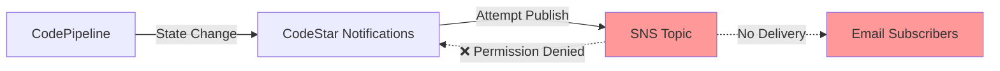
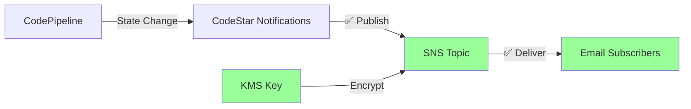
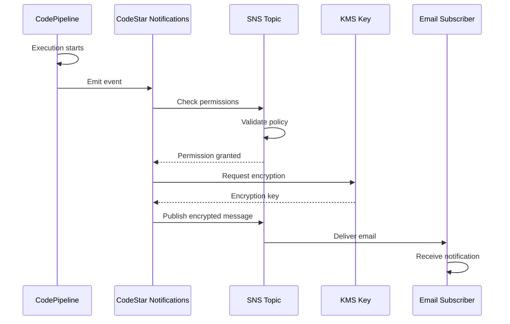

# Design Document

## Overview

This design document outlines the fix for SNS pipeline notifications in the ECS Fargate CI/CD infrastructure. The current implementation has SNS topics and CodeStar notification rules configured via Terraform, but notifications are not being delivered to email subscribers. The root cause is an incomplete SNS topic policy that doesn't grant CodeStar Notifications the necessary permissions to publish and subscribe to the SNS topic.

The fix involves:
1. Updating the SNS topic policy to explicitly allow CodeStar Notifications service principal
2. Ensuring notification rules are configured with all required event types
3. Verifying KMS key permissions for encrypted SNS topics
4. Providing diagnostic scripts to verify notification delivery
5. Documenting the subscription process for team members

## Architecture

### Current State



### Target State



### Component Interaction



## Components and Interfaces

### 1. SNS Topic Policy

**Purpose**: Control which AWS services and principals can interact with the SNS topic

**Current Issue**: The policy generated by Terraform only allows the account owner to publish, but doesn't explicitly grant permissions to CodeStar Notifications service.

**Required Policy Structure**:
```json
{
  "Version": "2012-10-17",
  "Statement": [
    {
      "Sid": "AllowCodeStarNotifications",
      "Effect": "Allow",
      "Principal": {
        "Service": "codestar-notifications.amazonaws.com"
      },
      "Action": [
        "SNS:Publish",
        "SNS:Subscribe"
      ],
      "Resource": "<SNS_TOPIC_ARN>",
      "Condition": {
        "StringEquals": {
          "aws:SourceAccount": "<AWS_ACCOUNT_ID>"
        }
      }
    }
  ]
}
```

**Key Elements**:
- **Principal**: `codestar-notifications.amazonaws.com` service
- **Actions**: Both `SNS:Publish` (to send notifications) and `SNS:Subscribe` (to register as a target)
- **Condition**: Restricts to specific AWS account for security

### 2. CodeStar Notification Rule

**Purpose**: Define which pipeline events trigger notifications and where to send them

**Configuration**:
- **Resource**: CodePipeline ARN
- **Event Types**: List of event type IDs to monitor
- **Targets**: SNS topic ARN(s) to publish to
- **Status**: ENABLED or DISABLED
- **Detail Type**: BASIC or FULL (FULL includes more event details)

**Event Type IDs**:
```
Non-Production Pipelines:
- codepipeline-pipeline-pipeline-execution-started
- codepipeline-pipeline-pipeline-execution-succeeded
- codepipeline-pipeline-pipeline-execution-failed
- codepipeline-pipeline-pipeline-execution-stopped
- codepipeline-pipeline-pipeline-execution-resumed
- codepipeline-pipeline-pipeline-execution-canceled
- codepipeline-pipeline-pipeline-execution-superseded

Production Pipelines (additional):
- codepipeline-pipeline-manual-approval-needed
- codepipeline-pipeline-manual-approval-succeeded
- codepipeline-pipeline-manual-approval-failed
```

### 3. KMS Key Policy

**Purpose**: Allow CodeStar Notifications to use the KMS key for encrypting SNS messages

**Required Policy Addition**:
```json
{
  "Sid": "AllowCodeStarNotificationsToUseKey",
  "Effect": "Allow",
  "Principal": {
    "Service": "codestar-notifications.amazonaws.com"
  },
  "Action": [
    "kms:Decrypt",
    "kms:GenerateDataKey"
  ],
  "Resource": "*",
  "Condition": {
    "StringEquals": {
      "kms:ViaService": "sns.<region>.amazonaws.com",
      "aws:SourceAccount": "<AWS_ACCOUNT_ID>"
    }
  }
}
```

### 4. Terraform Module Updates

**File**: `terraform/modules/cicd/main.tf`

**Changes Required**:

1. **Update SNS Topic Policy Resource** (around line 850):
```hcl
resource "aws_sns_topic_policy" "pipeline_notifications" {
  count = var.enable_pipeline && var.enable_notifications && var.notification_sns_topic_arn == "" ? 1 : 0

  arn = aws_sns_topic.pipeline_notifications[0].arn

  policy = jsonencode({
    Version = "2012-10-17"
    Statement = [
      {
        Sid    = "AllowCodeStarNotifications"
        Effect = "Allow"
        Principal = {
          Service = "codestar-notifications.amazonaws.com"
        }
        Action   = ["SNS:Publish", "SNS:Subscribe"]
        Resource = aws_sns_topic.pipeline_notifications[0].arn
        Condition = {
          StringEquals = {
            "aws:SourceAccount" = var.aws_account_id
          }
        }
      }
    ]
  })
}
```

2. **Verify Notification Rule Event Types** (around line 975):
```hcl
variable "notification_events" {
  type = list(string)
  default = [
    "codepipeline-pipeline-pipeline-execution-started",
    "codepipeline-pipeline-pipeline-execution-succeeded",
    "codepipeline-pipeline-pipeline-execution-failed",
    "codepipeline-pipeline-pipeline-execution-stopped",
    "codepipeline-pipeline-pipeline-execution-resumed",
    "codepipeline-pipeline-pipeline-execution-canceled",
    "codepipeline-pipeline-pipeline-execution-superseded"
  ]
}
```

3. **Update Production Pipeline Notification Rule** (around line 1005):
Ensure it includes approval events:
```hcl
event_type_ids = concat(var.notification_events, [
  "codepipeline-pipeline-manual-approval-needed",
  "codepipeline-pipeline-manual-approval-succeeded",
  "codepipeline-pipeline-manual-approval-failed"
])
```

### 5. KMS Key Module Updates

**File**: `terraform/modules/security/main.tf`

**Changes Required**:

Add CodeStar Notifications to KMS key policy:
```hcl
# Allow CodeStar Notifications to use the key for SNS encryption
statement {
  sid    = "AllowCodeStarNotificationsToUseKey"
  effect = "Allow"

  principals {
    type        = "Service"
    identifiers = ["codestar-notifications.amazonaws.com"]
  }

  actions = [
    "kms:Decrypt",
    "kms:GenerateDataKey"
  ]

  resources = ["*"]

  condition {
    test     = "StringEquals"
    variable = "kms:ViaService"
    values   = ["sns.${var.aws_region}.amazonaws.com"]
  }

  condition {
    test     = "StringEquals"
    variable = "aws:SourceAccount"
    values   = [var.aws_account_id]
  }
}
```

### 6. Diagnostic Scripts

**Purpose**: Provide tools to verify notification configuration and troubleshoot issues

**Scripts to Update**:

1. **check-notifications.sh**: Comprehensive diagnostic script
   - Lists SNS topics
   - Checks subscriptions and their status
   - Verifies notification rules
   - Checks SNS topic policies
   - Displays recent pipeline executions

2. **verify-notifications.sh**: End-to-end verification
   - Sends test message to SNS
   - Triggers pipeline execution
   - Monitors CloudWatch metrics
   - Provides diagnosis of issues

3. **subscribe-email.sh**: Helper script to subscribe emails
   - Prompts for email address
   - Subscribes to notification topics
   - Provides confirmation instructions

## Data Models

### SNS Topic Configuration

```hcl
resource "aws_sns_topic" "pipeline_notifications" {
  name              = "${local.name_prefix}-pipeline-notifications"
  kms_master_key_id = var.kms_key_arn
  
  tags = {
    Name        = "${local.name_prefix}-pipeline-notifications"
    Purpose     = "PipelineNotifications"
    Environment = var.environment
    ServiceName = var.service_name
  }
}
```

### Notification Rule Configuration

```hcl
resource "aws_codestarnotifications_notification_rule" "pipeline" {
  name        = "${local.name_prefix}-pipeline-notifications"
  detail_type = "FULL"
  resource    = aws_codepipeline.this[0].arn
  status      = "ENABLED"

  event_type_ids = var.notification_events

  target {
    type    = "SNS"
    address = aws_sns_topic.pipeline_notifications[0].arn
  }
}
```

### Email Subscription (via AWS CLI)

```bash
aws sns subscribe \
  --topic-arn arn:aws:sns:us-east-1:123456789012:pipeline-notifications \
  --protocol email \
  --notification-endpoint user@example.com
```

## Correctness Properties

*A property is a characteristic or behavior that should hold true across all valid executions of a system-essentially, a formal statement about what the system should do. Properties serve as the bridge between human-readable specifications and machine-verifiable correctness guarantees.*

Property 1: SNS topic policy allows CodeStar Notifications
*For any* SNS topic created for pipeline notifications, the topic policy should include a statement with Principal "codestar-notifications.amazonaws.com" and Actions including both "SNS:Publish" and "SNS:Subscribe"
**Validates: Requirements 4.1, 4.2**

Property 2: SNS topic policy restricts by account
*For any* SNS topic policy statement for CodeStar Notifications, the statement should include a Condition with "aws:SourceAccount" equal to the AWS account ID
**Validates: Requirements 4.3**

Property 3: Notification rule includes all pipeline event types
*For any* notification rule for non-production pipelines, the event_type_ids should include started, succeeded, failed, and stopped event types
**Validates: Requirements 5.1, 5.2, 5.3, 5.4**

Property 4: Notification rule is enabled
*For any* notification rule created by the module, the status should be set to "ENABLED"
**Validates: Requirements 5.5**

Property 5: Notification rule targets correct SNS topic
*For any* notification rule, the target address should match the ARN of the SNS topic created for that pipeline
**Validates: Requirements 5.6**

Property 6: Production pipelines include approval events
*For any* notification rule where pipeline_type is "production", the event_type_ids should include manual-approval-needed, manual-approval-succeeded, and manual-approval-failed event types
**Validates: Requirements 8.1, 8.4, 8.5**

Property 7: SNS topics use KMS encryption
*For any* SNS topic created for pipeline notifications, the kms_master_key_id should be set to a valid KMS key ARN
**Validates: Requirements 9.1**

Property 8: KMS key policy allows CodeStar Notifications
*For any* KMS key used for SNS encryption, the key policy should include a statement allowing "codestar-notifications.amazonaws.com" service principal to perform Decrypt and GenerateDataKey actions
**Validates: Requirements 9.2, 9.3**

Property 9: Notification resources created per environment
*For any* environment configuration with enable_notifications set to true, SNS topics and notification rules should be created with the environment name in their identifiers
**Validates: Requirements 10.1, 10.2**

Property 10: Event types consistent across environments
*For any* two notification rules in different environments, the base set of event_type_ids (excluding production-specific events) should be identical
**Validates: Requirements 10.3**

Property 11: SNS topic policies consistent across environments
*For any* two SNS topic policies in different environments, the policy structure and statements should be identical except for resource ARNs
**Validates: Requirements 10.4**

Property 12: Conditional resource creation
*For any* module invocation where enable_notifications is true, notification resources (SNS topics, notification rules) should be created; where enable_notifications is false, these resources should not be created
**Validates: Requirements 10.5, 10.6**

Property 13: CodeStar Notifications can publish without errors
*For any* SNS topic with the correct policy, when CodeStar Notifications attempts to publish a message, no AccessDenied errors should appear in CloudTrail logs
**Validates: Requirements 4.4**

Property 14: Notification messages contain required fields
*For any* notification message delivered by SNS, the message body should contain pipeline name, execution ID, and status fields
**Validates: Requirements 1.3, 2.3, 3.3**

Property 15: Failure notifications indicate failure in subject
*For any* notification message for a failed pipeline execution, the subject line should contain the word "FAILED" or "Failed"
**Validates: Requirements 3.5**

## Error Handling

### Permission Errors

**Symptom**: CodeStar Notifications cannot publish to SNS topic

**Detection**:
- CloudTrail shows AccessDenied errors for SNS:Publish from codestar-notifications.amazonaws.com
- Notification rule target status shows "UNREACHABLE" or "INACTIVE"
- CloudWatch metrics show zero messages published

**Resolution**:
1. Verify SNS topic policy includes CodeStar Notifications principal
2. Check KMS key policy if topic uses encryption
3. Run `terraform apply` to update policies
4. Use `aws codestar-notifications subscribe` to re-register the target

### Subscription Not Confirmed

**Symptom**: Notifications published but not delivered to email

**Detection**:
- CloudWatch metrics show messages published but not delivered
- SNS subscription status is "PendingConfirmation"

**Resolution**:
1. Check email inbox and spam folder for confirmation email from AWS
2. Click confirmation link in email
3. Verify subscription status changes to "Confirmed"
4. If confirmation email expired, unsubscribe and re-subscribe

### Wrong Event Types

**Symptom**: Some pipeline events don't trigger notifications

**Detection**:
- Notification rule exists but specific events don't send notifications
- CloudWatch metrics show fewer messages than expected

**Resolution**:
1. Check notification rule event_type_ids configuration
2. Verify event type IDs match AWS CodePipeline event names
3. Update Terraform variable `notification_events` if needed
4. Run `terraform apply` to update notification rule

### KMS Encryption Issues

**Symptom**: Notifications fail with encryption errors

**Detection**:
- CloudTrail shows KMS access denied errors
- SNS delivery failures in CloudWatch logs

**Resolution**:
1. Verify KMS key policy allows CodeStar Notifications
2. Check KMS key policy allows SNS service
3. Ensure condition restricts to correct AWS account
4. Update KMS key policy via Terraform
5. Run `terraform apply`

### Multiple Environments

**Symptom**: Notifications work in one environment but not another

**Detection**:
- Inconsistent behavior across develop/test/qa/prod
- Some pipelines send notifications, others don't

**Resolution**:
1. Verify `enable_notifications = true` in all service configurations
2. Check that all environments have been deployed with latest Terraform
3. Verify SNS topics exist in all environments
4. Check notification rules exist for all pipelines
5. Run `terraform apply` in each environment

## Testing Strategy

### Unit Testing

Unit tests will verify:
1. SNS topic policy JSON structure is valid
2. Notification rule configuration includes required fields
3. Event type IDs match AWS CodePipeline event names
4. Conditional resource creation based on `enable_notifications` variable
5. KMS key policy includes CodeStar Notifications permissions

### Property-Based Testing

Property-based tests will use **Terratest** with **pgregory.net/rapid** for Go-based testing.

**Test Configuration**:
- Minimum 100 iterations per property test
- Random generation of service names, environments, and configurations
- Terraform plan parsing to verify resource configurations

**Property Test Examples**:

1. **SNS Policy Structure**: Generate random service configurations, run `terraform plan`, parse the SNS topic policy, verify it contains the CodeStar Notifications statement

2. **Event Type Completeness**: For any pipeline type (feature/release/production), verify the notification rule includes all required event types

3. **Conditional Creation**: Generate configurations with enable_notifications true/false, verify resources are created/not created accordingly

4. **Cross-Environment Consistency**: Generate multiple environment configurations, verify policies and event types are consistent

### Integration Testing

Integration tests will verify end-to-end notification delivery:

1. **Deploy Test Infrastructure**:
   - Deploy Terraform configuration to test AWS account
   - Create test SNS subscription with SQS queue (for programmatic verification)

2. **Trigger Pipeline Events**:
   - Start a test pipeline execution
   - Wait for pipeline to complete
   - Verify notifications received in SQS queue

3. **Verify Message Content**:
   - Parse notification messages
   - Verify required fields present (pipeline name, execution ID, status)
   - Verify message format matches expectations

4. **Test All Event Types**:
   - Trigger successful pipeline
   - Trigger failed pipeline (intentional failure)
   - Stop a running pipeline
   - Verify all event types generate notifications

5. **Test Production Approval**:
   - Deploy production pipeline
   - Trigger execution requiring approval
   - Verify approval notification received
   - Approve deployment
   - Verify approval confirmation notification

### Manual Testing

Manual verification steps:

1. **Subscribe Email**:
   ```bash
   aws sns subscribe \
     --topic-arn <TOPIC_ARN> \
     --protocol email \
     --notification-endpoint test@example.com
   ```

2. **Confirm Subscription**:
   - Check email inbox
   - Click confirmation link

3. **Trigger Pipeline**:
   ```bash
   aws codepipeline start-pipeline-execution \
     --name <PIPELINE_NAME>
   ```

4. **Verify Email Received**:
   - Check inbox within 2 minutes
   - Verify email contains pipeline details
   - Verify subject line is clear

5. **Check Metrics**:
   ```bash
   aws cloudwatch get-metric-statistics \
     --namespace AWS/SNS \
     --metric-name NumberOfMessagesPublished \
     --dimensions Name=TopicName,Value=<TOPIC_NAME> \
     --start-time <START> \
     --end-time <END> \
     --period 300 \
     --statistics Sum
   ```

### Diagnostic Scripts

**check-notifications.sh**:
- Lists all SNS topics
- Shows subscription status
- Displays notification rules
- Checks recent pipeline executions
- Provides diagnosis and fix recommendations

**verify-notifications.sh**:
- Sends test message to SNS
- Triggers pipeline execution
- Monitors CloudWatch metrics
- Verifies end-to-end delivery

**subscribe-email.sh**:
- Interactive script to subscribe emails
- Handles multiple environments
- Provides confirmation instructions

## Implementation Notes

### Terraform State

- SNS topic policy changes may require `terraform apply` to be run twice
- First apply creates the policy resource
- Second apply may be needed if policy attachment fails initially
- Use `terraform plan` to verify changes before applying

### AWS Service Limits

- SNS topics: 100,000 per account (default)
- SNS subscriptions: 12,500,000 per topic (default)
- Notification rules: 2,000 per account (default)
- These limits are sufficient for typical use cases

### Cost Considerations

- SNS: $0.50 per 1 million requests
- SNS email: $2.00 per 100,000 emails
- KMS: $1.00 per month per key + $0.03 per 10,000 requests
- Typical cost for notifications: < $5/month per environment

### Security Best Practices

1. Always use KMS encryption for SNS topics
2. Restrict SNS topic policies to specific AWS account
3. Use IAM conditions to limit service access
4. Regularly audit SNS subscriptions
5. Monitor CloudTrail for unauthorized access attempts

### Rollout Strategy

1. **Phase 1**: Update Terraform modules (no impact to existing resources)
2. **Phase 2**: Apply to develop environment first
3. **Phase 3**: Verify notifications working in develop
4. **Phase 4**: Roll out to test, qa, prod sequentially
5. **Phase 5**: Subscribe team members to notification topics
6. **Phase 6**: Document process and train team

